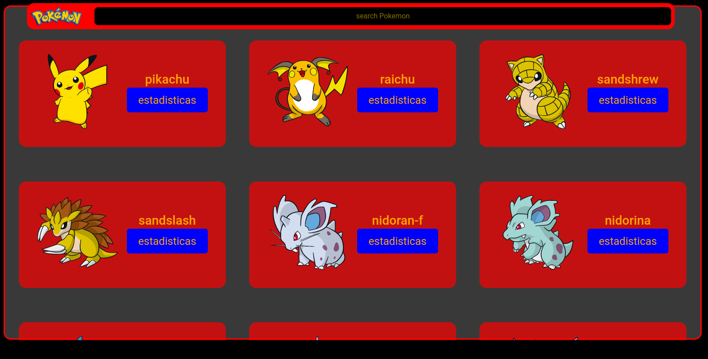
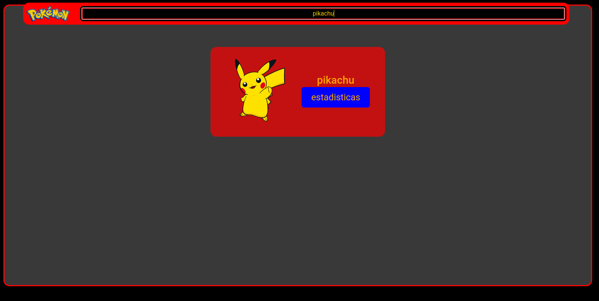
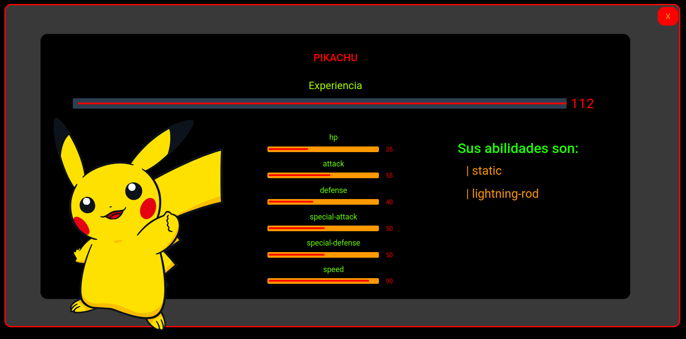

# <label style="color: yellow; font-size: 150%" > Pokedesk de</label>   

# <label style="color: red"> Appearance </label>   

# <label style="color: red"> You can search for your Pokemon </label>   

# <label style="color: red"> You can view the statistics of your Pokémon </label>   

